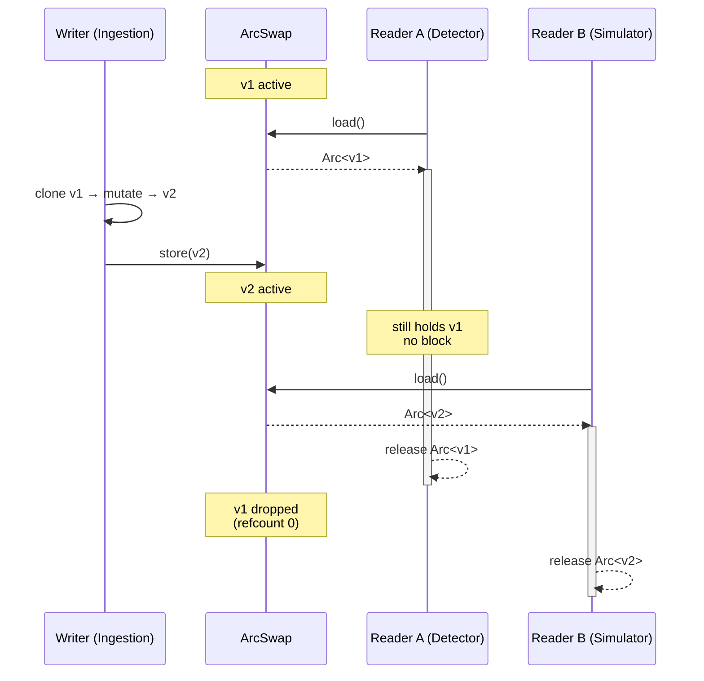
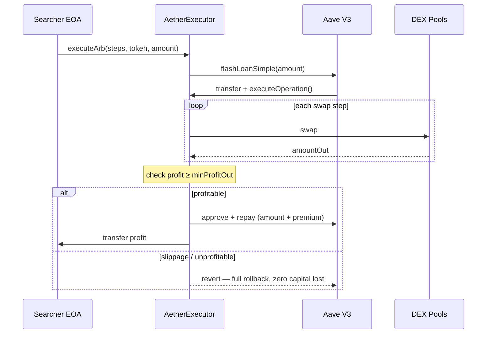

# Design Decisions

This page explains the key architectural choices in Aether and the reasoning behind them.

## Rust for Hot Path, Go for Coordination

**Decision:** All latency-critical code (ingestion, detection, simulation) is written in Rust. All coordination code (execution, risk, monitoring) is written in Go.

**Why:** MEV arbitrage is a latency competition. The bot that detects and submits fastest wins. Rust's zero-cost abstractions, control over memory layout, and lack of garbage collector are critical for sub-millisecond detection. But Rust's ecosystem for network coordination (HTTP clients, Prometheus, concurrent goroutine-style patterns) is less mature than Go's. Go excels at concurrent network I/O — exactly what bundle submission and monitoring need.

**Tradeoff:** Two languages means two build systems, two sets of dependencies, and a serialization boundary (gRPC). The ~1μs gRPC overhead is negligible compared to the performance gains.

## Negative Log Edge Weights (`-ln(rate)`)

**Decision:** Exchange rates in the price graph are stored as `-ln(rate)` instead of raw rates.

**Why:** Arbitrage detection is fundamentally about finding cycles where the product of exchange rates exceeds 1.0:

```
rate_1 × rate_2 × ... × rate_n > 1.0
```

By taking `-ln()` of each rate, this multiplicative condition becomes additive:

```
-ln(rate_1) + -ln(rate_2) + ... + -ln(rate_n) < 0
```

A **negative sum** around a cycle means a profitable trade. This transforms the problem into classic negative cycle detection — exactly what Bellman-Ford solves.

**Tradeoff:** Floating-point precision loss in the log transformation. Mitigated by using `f64` (which has more than enough precision for exchange rate ratios) and validating with full-precision U256 simulation before execution.

## SPFA over Standard Bellman-Ford

**Decision:** Use SPFA (Shortest Path Faster Algorithm) with SLF (Shortest-Label-First) optimization instead of standard Bellman-Ford.

**Why:** Standard Bellman-Ford relaxes all edges V-1 times (O(V×E)). SPFA uses a queue-based approach that only processes nodes whose distances were actually updated. For the sparse, partially-updated graphs typical in DEX arbitrage, SPFA is 2-3x faster.

SLF further optimizes by inserting nodes with shorter labels at the front of the deque instead of the back, reducing redundant relaxations.

**Tradeoff:** SPFA has the same worst-case complexity as standard Bellman-Ford (O(V×E)), but in practice the average case is much faster for sparse graphs with localized updates.

## MVCC Snapshots for Price Graph

**Decision:** The price graph uses MVCC (Multi-Version Concurrency Control) via `Arc<ArcSwap<GraphSnapshot>>`.

**Why:** The detection engine reads the price graph while the ingestion engine writes to it. A naive approach (RwLock) would block the detection engine during writes — unacceptable on the hot path. MVCC eliminates this:

- **Writers** create a new graph snapshot and atomically swap it in
- **Readers** hold a reference to an immutable snapshot — no locks, no blocking
- Old snapshots are automatically freed when all readers release their references

**Tradeoff:** Higher memory usage (multiple graph versions in flight). In practice, only 2-3 versions exist simultaneously, and the graph is small enough (~5K nodes, ~20K edges) that this is negligible.



## Flash Loan Execution (Zero Capital at Risk)

**Decision:** All arbitrage trades use Aave V3 flash loans. The bot holds no trading capital.

**Why:**
1. **Zero capital risk** — If a trade is unprofitable, the flash loan reverts atomically. No capital is ever lost.
2. **No capital requirements** — The bot only needs ~0.5 ETH for gas. Flash loans provide the trading capital.
3. **Larger trade sizes** — Can execute trades up to the flash loan pool depth (millions of dollars), far more than any capital the bot could hold.

**Tradeoff:** Flash loan premium (0.05% on Aave V3) reduces profit margins. For most arbitrage opportunities, this is negligible compared to the profit.



## Multi-Builder Bundle Submission

**Decision:** Submit bundles to all configured block builders simultaneously (Flashbots, Titan, Beaver, rsync).

**Why:** No single builder produces every block. By submitting to all builders, the probability of bundle inclusion increases from ~15-20% (single builder) to ~50-70% (all major builders).

**Tradeoff:** Bundle contents are visible to all builders. This is acceptable because:
- Bundles are already signed and target a specific block
- Builder competition incentivizes inclusion (they keep the tip)
- Private mempool (Flashbots Protect) prevents public frontrunning

## gRPC over Unix Domain Sockets

**Decision:** Rust and Go communicate via gRPC over UDS instead of TCP, shared memory, or direct FFI.

**Why:**
- **UDS** adds sub-microsecond latency (vs ~100μs for TCP localhost)
- **gRPC** provides structured schemas, streaming, and ecosystem tooling
- **Protobuf** gives a single source of truth for message types across Rust and Go
- **vs. shared memory:** More complex, error-prone, and only marginally faster for the message sizes involved
- **vs. FFI:** Would tightly couple Rust and Go, complicating deployment and debugging

**Tradeoff:** Protobuf serialization/deserialization adds ~1-5μs overhead. Acceptable given the overall 15ms pipeline budget.

## DashMap over RwLock for Pool State

**Decision:** Pool states are stored in `DashMap<Address, Box<dyn Pool>>` instead of a `HashMap` behind an `RwLock`.

**Why:** `DashMap` is a concurrent hashmap with fine-grained locking (sharded internally). Multiple ingestion tasks can update different pools simultaneously without blocking each other or blocking the detection engine.

**Tradeoff:** Slightly higher per-operation overhead than a raw `HashMap`. Negligible compared to the contention cost of a single `RwLock`.

## Tiered Pool Management (Hot/Warm/Cold)

**Decision:** Pools are classified into tiers with different update frequencies.

**Why:** Monitoring 5,000+ pools at full frequency wastes CPU on pools with minimal activity. Tiering focuses resources:

| Tier | Frequency | Criteria |
|---|---|---|
| Hot | Every block | High liquidity, high volume, frequently arbed |
| Warm | Every N blocks | Medium liquidity, moderate volume |
| Cold | On-demand | Low liquidity, checked only when price graph changes suggest opportunity |

**Tradeoff:** Cold pools may have stale state, causing missed opportunities. Mitigated by the qualification pipeline promoting pools that show activity.

## EIP-1559 Transactions (not legacy)

**Decision:** All transactions use EIP-1559 `DynamicFeeTx` format.

**Why:** EIP-1559 transactions have more predictable inclusion behavior. The `maxFeePerGas` / `maxPriorityFeePerGas` split allows precise control over gas bidding. Legacy transactions with a single `gasPrice` can overpay when base fee fluctuates.

**Tradeoff:** None significant. EIP-1559 is the standard for all modern Ethereum transactions.
