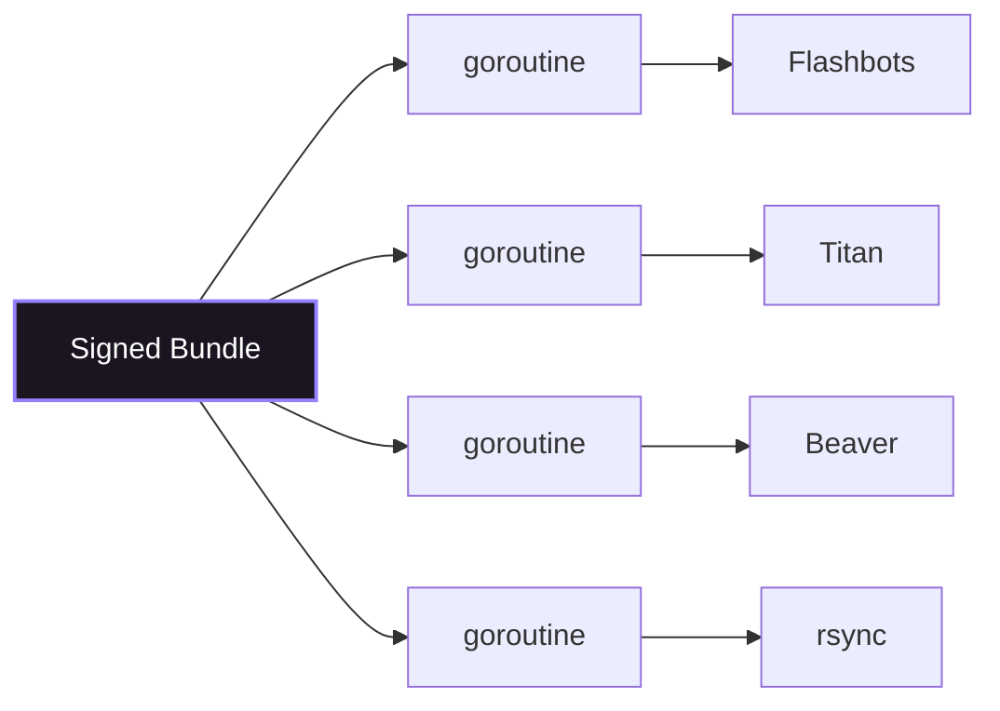
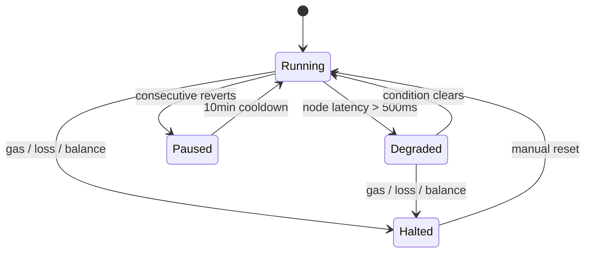

# Go Services

The Go execution layer receives validated arbitrage opportunities from the Rust core and handles bundle construction, submission, risk management, and monitoring. It consists of three services in the `cmd/` directory.

## `cmd/executor/` — Bundle Construction & Submission

### Bundle Structure

Every Flashbots bundle contains two transactions:

1. **Arb transaction** — Calls `AetherExecutor.executeArb()` with the swap steps
2. **Tip transaction** — Sends a share of expected profit to the builder's coinbase address

```
Bundle = [arb_tx, tip_tx]
```

### Transaction Construction (`bundle.go`)

Arb transactions use **EIP-1559 `DynamicFeeTx`** with:
- `maxFeePerGas` = current base fee + suggested priority fee
- `maxPriorityFeePerGas` = from the gas oracle
- `to` = `AetherExecutor` contract address
- `data` = `executeArb()` calldata (received from Rust via gRPC)

The tip transaction sends **90% of expected profit** to `block.coinbase` to incentivize builders to include the bundle.

### Multi-Builder Submission (`submitter.go`)

Bundles are submitted to all configured builders **simultaneously** via goroutine fan-out:



Each builder receives `eth_sendBundle` with the target block number. The first builder to include the bundle wins.

Submission respects `context.Context` for cancellation — if the target block passes, all pending submissions are cancelled.

### Nonce Management (`nonce.go`)

- **Atomic local counter** — Incremented on each transaction, lock-free via `sync/atomic`
- **Periodic sync** — `eth_getTransactionCount` every N blocks to correct drift
- **Pending tracker** — Tracks in-flight transactions to avoid nonce gaps

### Gas Oracle (`gas_oracle.go`)

EIP-1559 base fee prediction and priority fee estimation:

- Tracks base fee trends across recent blocks
- Suggests priority fee based on builder competition
- Feeds into both arb transaction construction and profitability calculations

## `cmd/risk/` — Risk Management

### System State Machine (`state.go`)

The risk manager maintains a finite state machine:



| State | Meaning | Recovery |
|---|---|---|
| **Running** | Normal operation | — |
| **Degraded** | Reduced functionality (e.g., high node latency) | Automatic when condition clears |
| **Paused** | Detection paused (e.g., consecutive reverts) | Automatic after cooldown (10 min) |
| **Halted** | All operations stopped | **Manual reset required** |

### Circuit Breakers (`manager.go`)

The `PreflightCheck` function runs before every bundle submission:

| Condition | Action |
|---|---|
| Gas price >300 gwei | **HALT** |
| 10 consecutive reverts in 10 min | **PAUSE** |
| Daily loss >0.5 ETH | **HALT** |
| ETH balance <0.1 ETH | **HALT** |
| Node latency >500ms | **DEGRADE** |
| Bundle miss rate >80% in 1 hour | **ALERT** |

Each circuit breaker is implemented as a stateful controller using `sync/atomic` for lock-free state transitions.

### Position Limits

| Parameter | Default | Purpose |
|---|---|---|
| Max single trade | 50 ETH | Cap per-trade exposure |
| Max daily volume | 500 ETH | Cap daily throughput |
| Min profit | 0.001 ETH | Reject dust-level opportunities |
| Min tip share | 50% | Minimum builder incentive |
| Max tip share | 95% | Retain minimum profit |

## `cmd/monitor/` — Monitoring & Observability

### Prometheus Metrics (`metrics.go`)

Exposes all system metrics on `:9090/metrics`. Key metrics include:

- `aether_opportunities_detected_total` (Counter) — Arbitrage opportunities found
- `aether_bundles_submitted_total` (Counter) — Bundles submitted to builders
- `aether_bundles_included_total` (Counter) — Bundles included on-chain
- `aether_detection_latency_ms` (Histogram) — Detection pipeline latency
- `aether_simulation_latency_ms` (Histogram) — EVM simulation latency
- `aether_end_to_end_latency_ms` (Histogram) — Full pipeline latency
- `aether_gas_price_gwei` (Gauge) — Current gas price
- `aether_daily_pnl_eth` (Gauge) — Daily profit/loss
- `aether_eth_balance` (Gauge) — Searcher wallet balance

See [Metrics Reference](/reference/metrics) for the complete list.

### Dashboard (`dashboard.go`)

HTTP dashboard server on `:8080` providing:

- Real-time system state and health status
- Recent opportunities and bundle results
- Performance metrics and latency percentiles
- Circuit breaker status

### Alerter (`alerter.go`)

Dispatches alerts to **Slack** with severity-based channel routing:

| Channel | Severity | Configuration |
|---|---|---|
| `#aether-alerts-sev1` | SEV1 | `config/risk.yaml → alerting.slack` |
| `#aether-alerts-sev2` | SEV2 | `config/risk.yaml → alerting.slack` |
| `#aether-alerts` | SEV3, SEV4 | `config/risk.yaml → alerting.slack` |

## Runtime Configuration

The Go executor uses these production settings:

```
GOMAXPROCS=2      # Limit to 2 OS threads (pinned to CPU 4-5)
GOGC=200          # Reduce GC frequency (trade memory for latency)
```

All goroutines must respect `context.Context` for cancellation propagation. The executor gracefully drains in-flight bundles on shutdown.
