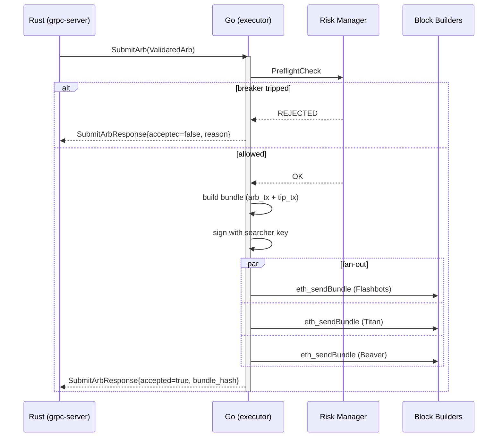
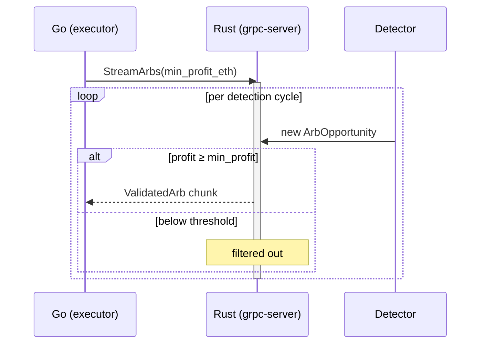
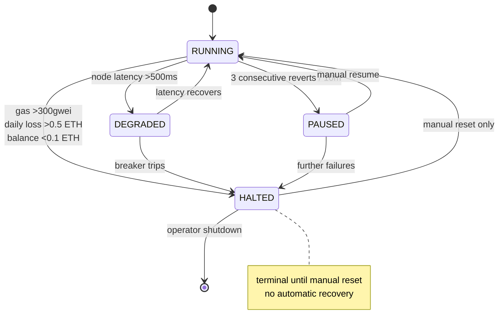

# gRPC Protocol

Aether uses gRPC over Unix Domain Sockets for communication between the Rust core and Go execution layer. The Protobuf schema in `proto/aether.proto` is the single source of truth.

## Transport

- **Protocol:** gRPC (HTTP/2)
- **Transport:** Unix Domain Socket (sub-microsecond latency)
- **Serialization:** Protocol Buffers v3
- **Rust framework:** `tonic`
- **Go framework:** `google.golang.org/grpc`

UDS was chosen over TCP because both services run on the same machine. UDS eliminates the network stack entirely — data transfer is effectively a memory copy.

## Services

### ArbService

Handles arbitrage opportunity flow from Rust to Go.

```protobuf
service ArbService {
    rpc SubmitArb(ValidatedArb) returns (SubmitArbResponse);
    rpc StreamArbs(StreamArbsRequest) returns (stream ValidatedArb);
}
```

**`SubmitArb`** — Single arb submission. Rust sends a validated opportunity, Go returns acceptance status and bundle hash.

**`StreamArbs`** — Server-side streaming. Go subscribes to a stream of opportunities from Rust, optionally filtered by minimum profit threshold.

#### SubmitArb — call sequence



#### StreamArbs — server-side stream



### HealthService

Health checks from Go to Rust.

```protobuf
service HealthService {
    rpc Check(HealthCheckRequest) returns (HealthCheckResponse);
}
```

Returns engine health including: healthy/unhealthy status, uptime, last processed block, and active pool count.

### ControlService

Operational control from Go to Rust.

```protobuf
service ControlService {
    rpc SetState(SetStateRequest) returns (SetStateResponse);
    rpc ReloadConfig(ReloadConfigRequest) returns (ReloadConfigResponse);
}
```

**`SetState`** — Pause/resume the detection engine. Used by the risk manager to halt detection when circuit breakers trip.

**`ReloadConfig`** — Hot-reload the pool configuration (`pools.toml`) without restarting the Rust core.

## Enums

### ProtocolType

```protobuf
enum ProtocolType {
    PROTOCOL_UNKNOWN = 0;
    UNISWAP_V2 = 1;
    UNISWAP_V3 = 2;
    SUSHISWAP = 3;
    CURVE = 4;
    BALANCER_V2 = 5;
    BANCOR_V3 = 6;
}
```

Maps 1:1 with the Rust `ProtocolType` enum and the Solidity protocol constants in `AetherExecutor.sol`.

### SystemState

```protobuf
enum SystemState {
    STATE_UNKNOWN = 0;
    RUNNING = 1;
    DEGRADED = 2;
    PAUSED = 3;
    HALTED = 4;
}
```

#### State transitions



## Messages

### ValidatedArb

The core message — a simulation-verified arbitrage opportunity:

```protobuf
message ValidatedArb {
    string id = 1;                    // Unique opportunity ID
    repeated ArbHop hops = 2;         // Hop sequence (detection output)
    bytes total_profit_wei = 3;       // Gross profit in wei
    uint64 total_gas = 4;             // Estimated total gas
    bytes gas_cost_wei = 5;           // Gas cost in wei
    bytes net_profit_wei = 6;         // Net profit (gross - gas - premium)
    uint64 block_number = 7;          // Target block number
    int64 timestamp_ns = 8;           // Detection timestamp (nanoseconds)
    bytes flashloan_token = 9;        // Token to borrow
    bytes flashloan_amount = 10;      // Amount to borrow
    repeated SwapStep steps = 11;     // Execution steps (for calldata)
    bytes calldata = 12;              // Pre-built AetherExecutor calldata
}
```

### ArbHop

A single hop in the arbitrage path (detection-level detail):

```protobuf
message ArbHop {
    ProtocolType protocol = 1;
    bytes pool_address = 2;
    bytes token_in = 3;
    bytes token_out = 4;
    bytes amount_in = 5;
    bytes expected_out = 6;
    uint64 estimated_gas = 7;
}
```

### SwapStep

A single swap step for on-chain execution:

```protobuf
message SwapStep {
    ProtocolType protocol = 1;
    bytes pool_address = 2;
    bytes token_in = 3;
    bytes token_out = 4;
    bytes amount_in = 5;
    bytes min_amount_out = 6;
    bytes calldata = 7;
}
```

### Request/Response Messages

```protobuf
message SubmitArbResponse {
    bool accepted = 1;
    string bundle_hash = 2;
    string error = 3;
}

message StreamArbsRequest {
    double min_profit_eth = 1;    // Minimum net profit filter
}

message HealthCheckResponse {
    bool healthy = 1;
    string status = 2;
    int64 uptime_seconds = 3;
    uint64 last_block = 4;
    uint32 active_pools = 5;
}

message SetStateRequest {
    SystemState state = 1;
    string reason = 2;
}

message SetStateResponse {
    bool success = 1;
    SystemState previous_state = 2;
}

message ReloadConfigRequest {
    string config_path = 1;
}

message ReloadConfigResponse {
    bool success = 1;
    uint32 pools_loaded = 2;
    string error = 3;
}
```

## Usage Examples

### Check Engine Health

```bash
grpcurl -plaintext localhost:50051 aether.HealthService/Check
```

### Pause Detection

```bash
grpcurl -plaintext localhost:50051 aether.ControlService/SetState \
    -d '{"state": "PAUSED", "reason": "manual maintenance"}'
```

### Resume Detection

```bash
grpcurl -plaintext localhost:50051 aether.ControlService/SetState \
    -d '{"state": "RUNNING"}'
```

### Hot-Reload Pool Config

```bash
grpcurl -plaintext localhost:50051 aether.ControlService/ReloadConfig
```

### Stream Opportunities (min 0.01 ETH profit)

```bash
grpcurl -plaintext localhost:50051 aether.ArbService/StreamArbs \
    -d '{"min_profit_eth": 0.01}'
```
