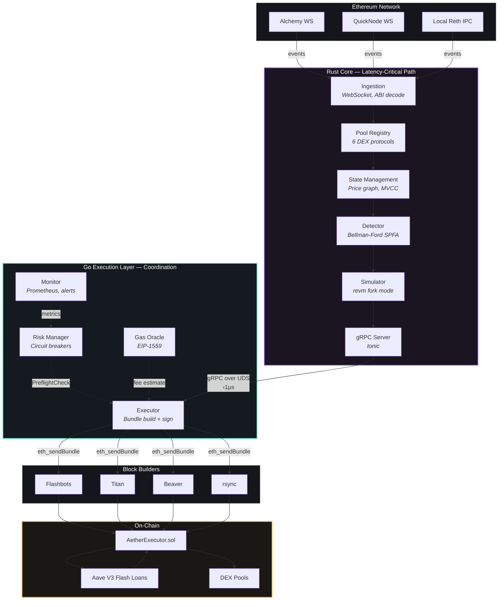
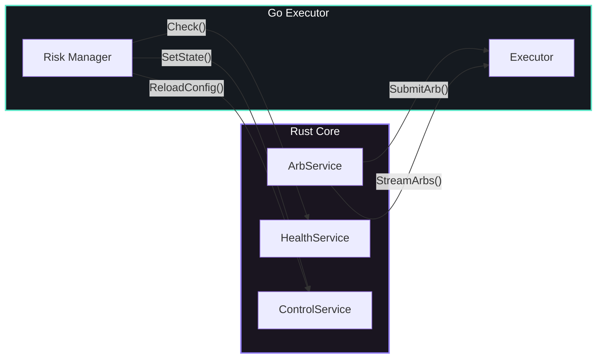

# Architecture Overview

Aether is organized into three distinct layers — a Rust core for latency-critical work, a Go coordination layer for execution and monitoring, and a Solidity contract for on-chain settlement.

## System Diagram

## Layer Responsibilities

### Rust Core (Latency-Critical)

The Rust core handles everything on the hot path — from event ingestion to validated arbitrage output.

<Accordion>
  <AccordionItem title="Ingestion — WebSocket event processing">

Manages 3+ node connections with automatic failover. ABI decoding via `alloy::sol!` at compile time. Lock-free broadcast channels for event dispatch.

  </AccordionItem>
  <AccordionItem title="Pools — 6 DEX protocol implementations">

Uniswap V2/V3, SushiSwap, Curve, Balancer, Bancor. Each implements the `Pool` trait. Factory monitoring for new pool discovery. Tiered management (Hot/Warm/Cold).

  </AccordionItem>
  <AccordionItem title="State — Price graph and MVCC snapshots">

Directed graph with `-ln(rate)` edge weights. Dirty bit tracking for incremental updates. Lock-free MVCC via `Arc<ArcSwap<GraphSnapshot>>` — readers never block writers.

  </AccordionItem>
  <AccordionItem title="Detector — Bellman-Ford arbitrage detection">

SPFA variant with SLF optimization, 2-3x faster than standard. Ternary search for optimal input. Per-protocol gas estimation.

  </AccordionItem>
  <AccordionItem title="Simulator — EVM simulation via revm">

Fork latest block into `CacheDB`, execute exact calldata, validate profit. Must use same block state as execution target.

  </AccordionItem>
  <AccordionItem title="gRPC Server — Binary entry point">

tonic-based gRPC server exposing `ArbService`, `HealthService`, `ControlService`. Listens on Unix Domain Socket.

  </AccordionItem>
</Accordion>

See [Rust Core](/architecture/rust-core) for a deep dive into each crate.

### Go Execution Layer (Coordination)

<Accordion>
  <AccordionItem title="Executor — Bundle construction and submission">

Builds Flashbots bundles (arb_tx + tip_tx), signs with searcher key, fans out to all builders via goroutines. Atomic nonce management.

  </AccordionItem>
  <AccordionItem title="Risk Manager — Circuit breakers and limits">

State machine: Running / Degraded / Paused / Halted. Circuit breakers for gas price, reverts, daily loss, balance. Position limits for trade size, volume, and tip share.

  </AccordionItem>
  <AccordionItem title="Monitor — Prometheus and alerting">

Exposes all metrics on `:9090/metrics`. HTTP dashboard on `:8080`. Alert dispatch to Slack with severity-based channel routing.

  </AccordionItem>
</Accordion>

See [Go Services](/architecture/go-services) for details.

### On-Chain (Solidity)

`AetherExecutor.sol` receives flash loans from Aave V3 and executes multi-hop swaps. If any trade is unprofitable, it reverts atomically.

See [Smart Contract](/architecture/smart-contract) for the contract walkthrough.

## Data Flow

<Timeline>
  <TimelineItem time="< 1ms" title="Event Ingestion">

WebSocket event arrives → ABI decoded → pool state updated → price graph edges recomputed

  </TimelineItem>
  <TimelineItem time="< 3ms" title="Detection">

Bellman-Ford scans dirty subgraph → negative cycle found → input optimized → gas estimated

  </TimelineItem>
  <TimelineItem time="< 5ms" title="Simulation">

revm fork created → calldata built → simulation executed → profit verified

  </TimelineItem>
  <TimelineItem time="< 1ms" title="Handoff">

ValidatedArb sent to Go executor via gRPC over UDS

  </TimelineItem>
  <TimelineItem time="< 2ms" title="Bundle Build">

EIP-1559 transactions constructed and signed (arb_tx + tip_tx)

  </TimelineItem>
  <TimelineItem time="—" title="Submission" color="green">

`eth_sendBundle` fan-out to all configured block builders

  </TimelineItem>
</Timeline>

## Inter-Service Communication

Rust and Go communicate via **gRPC over Unix Domain Sockets** — sub-microsecond transport.

| Service | Direction | Purpose |
|---|---|---|
| `ArbService.SubmitArb()` | Rust → Go | Submit validated arb for execution |
| `ArbService.StreamArbs()` | Rust → Go | Server-side streaming of opportunities |
| `HealthService.Check()` | Go → Rust | Engine health check |
| `ControlService.SetState()` | Go → Rust | Pause/resume detection |
| `ControlService.ReloadConfig()` | Go → Rust | Hot-reload pool config |

See [gRPC Protocol](/architecture/grpc-protocol) for the full schema reference.

## Performance Targets

| Metric | Target |
|---|---|
| Event decode + state update | <1ms |
| Bellman-Ford detection | <3ms |
| EVM simulation (revm) | <5ms |
| gRPC Rust → Go | <1ms |
| Bundle build + sign | <2ms |
| **Total end-to-end** | **<15ms** |
| Events processed per block | 10,000+ |
| Pools monitored simultaneously | 5,000+ |
| Opportunities evaluated per block | 500+ |
| Simulations per second | 200+ |
| Rust core memory | <2 GB RSS |
| Go executor memory | <512 MB RSS |
