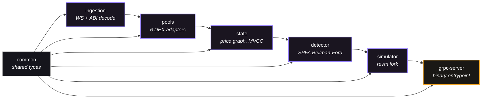
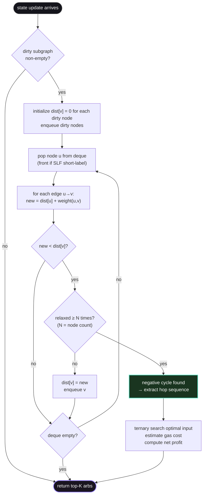

# Rust Core

The Rust core handles all latency-critical work — from ingesting Ethereum events to producing validated arbitrage opportunities. It consists of 7 crates in the `crates/` directory.

## Crate Dependency Graph



`grpc-server` is the binary entry point that wires everything together. `common` is a leaf dependency used by every other crate.

## Hot Path — Per-Event Flow


## `crates/common/` — Shared Types

Defines types shared across all crates:

- **`ProtocolType`** enum — `UniswapV2`, `UniswapV3`, `SushiSwap`, `Curve`, `BalancerV2`, `BancorV3`
- **`ArbOpportunity`** / **`ArbHop`** — Detected arbitrage with hop details
- **`SwapStep`** — Execution step (protocol, pool, tokens, amounts)
- **`ValidatedArb`** — Simulation-verified arb ready for execution
- **`SimulationResult`** — EVM simulation output (success/revert, gas, profit)
- **`AetherError`** — Structured error types via `thiserror`

## `crates/ingestion/` — Data Ingestion

WebSocket/IPC event ingestion from Ethereum nodes.

### Node Pool

Manages connections to multiple Ethereum node providers with a per-connection state machine:

```
Connected → Healthy → Degraded → Reconnecting → Failed
```

- Maintains 3+ providers (Alchemy WS, QuickNode WS, local Reth IPC)
- Exponential backoff on reconnection
- Minimum 2 healthy nodes required for operation
- Nodes are prioritized: IPC (lowest latency) > WebSocket

### Event Decoder

Compile-time ABI decoding via the `alloy::sol!` macro. Handles events from all supported protocols:

| Event | Protocol | Trigger |
|---|---|---|
| `Sync(uint112, uint112)` | Uniswap V2, SushiSwap | Reserve update |
| `Swap(...)` | Uniswap V2, SushiSwap | Trade executed |
| `SwapV3(...)` | Uniswap V3 | Trade executed |
| `TokenExchange(...)` | Curve | StableSwap trade |
| `BalancerSwap(...)` | Balancer V2 | Weighted pool trade |
| `TokensTraded(...)` | Bancor V3 | Bonding curve trade |
| `PairCreated(...)` | Factory contracts | New pool deployed |

Performance: topic matching ~4 CPU cycles, full decode <200ns/event.

### Dispatch

Decoded events are broadcast through lock-free channels:

- `pool_updates_tx` — Pool state changes (reserves, ticks, etc.)
- `new_block_tx` — New block headers
- `pending_tx_tx` — Pending mempool transactions

Uses `tokio::sync::broadcast` for multi-consumer, lock-free delivery.

## `crates/pools/` — DEX Pool Implementations

### The `Pool` Trait

Every DEX protocol implements this trait:

```rust
trait Pool {
    fn protocol(&self) -> ProtocolType;
    fn address(&self) -> Address;
    fn tokens(&self) -> (Address, Address);
    fn fee_bps(&self) -> u32;
    fn get_amount_out(&self, amount_in: U256, token_in: Address) -> U256;
    fn get_amount_in(&self, amount_out: U256, token_out: Address) -> U256;
    fn update_state(&mut self, event: &DecodedEvent);
    fn encode_swap(&self, step: &SwapStep) -> Bytes;
    fn liquidity_depth(&self) -> U256;
}
```

### Protocol Implementations

**Uniswap V2 / SushiSwap** — Constant product AMM, O(1):
```
dy = (dx * 997 * y) / (x * 1000 + dx * 997)
```

**Uniswap V3** — Concentrated liquidity, O(n_ticks):
- Q96 fixed-point math for `sqrtPriceX96`
- Tick traversal for cross-tick swaps
- Complexity depends on number of ticks crossed

**Curve** — StableSwap invariant, O(iterations):
- Newton's method to solve the StableSwap invariant
- Converges in ~10 iterations for typical pools

**Balancer V2** — Weighted constant product, O(1):
- Generalized constant product with configurable token weights
- `outAmount = balance_out * (1 - (balance_in / (balance_in + amount_in))^(w_in/w_out))`

**Bancor V3** — Bonding curve, O(1):
- BNT intermediary token
- Separate pricing for BNT leg and target token leg

### Pool Registry

Discovery and lifecycle management:

1. **Factory monitoring** — Watches `PairCreated`/`PoolCreated` events for new pools
2. **Static registry** — Pools configured in `config/pools.toml`
3. **On-chain scan** — Periodic scan for missed pools
4. **Qualification** — Filters: liquidity >$10K, 24h volume >$1K, age >100 blocks, rug-pull score <0.3
5. **Tiering** — Pools are tiered as Hot (every block), Warm (periodic), or Cold (on-demand)

## `crates/state/` — State Management

### Price Graph

A directed graph where:
- **Nodes** = token addresses (mapped to `usize` indices via `TokenIndex`)
- **Edges** = negative log-transformed exchange rates: **`-ln(rate)`**

This transformation is the key insight: a **negative weight cycle** in this graph represents a profitable arbitrage path. The sum of edge weights around a cycle being negative means the product of exchange rates exceeds 1.0.

Only edges affected by incoming events are recomputed — dirty flags tracked via `BitVec` for O(1) marking and scanning.

### MVCC Snapshots

```rust
Arc<ArcSwap<GraphSnapshot>>
```

- **Writers** atomically swap in new graph versions
- **Readers** get zero-copy immutable references to the current snapshot
- No locks on the hot path — readers never block writers

### Token Index

Bidirectional mapping between token `Address` and graph node `usize` index. Enables O(1) lookup in both directions.

## `crates/detector/` — Arbitrage Detection

### Bellman-Ford (SPFA Variant)

The detection engine uses a modified Bellman-Ford algorithm — specifically the **Shortest Path Faster Algorithm (SPFA)** with **Shortest-Label-First (SLF)** optimization:

- ~2-3x faster than standard Bellman-Ford for sparse graphs
- Detects negative cycles by checking if a node is relaxed N times (where N = number of nodes)
- **Early exit** on first negative cycle found
- Only scans the subgraph affected by recent state updates (dirty nodes)



### Input Optimizer

Once a profitable cycle is found, **ternary search** finds the optimal input amount:

- Searches over the profit function (which is concave for AMM-based DEXes)
- ~100 iterations, converges in ~60 for U256 precision
- Accounts for price impact: larger inputs reduce marginal returns

### Gas Estimation

Per-protocol base gas costs:

| Protocol | Base Gas | Notes |
|---|---|---|
| Uniswap V2 | 60,000 | Constant product, single storage read |
| Uniswap V3 | 180,000 + 5,000/tick | Varies with ticks crossed |
| SushiSwap | 60,000 | Same as UniV2 |
| Curve | 130,000 | Newton's method iterations |
| Balancer V2 | 120,000 | Weighted math |
| Bancor V3 | 150,000 | Two-leg swap through BNT |

Additional overhead: 80,000 (flash loan) + 21,000 (base tx) + 30,000 (executor contract).

### Output

Top-K `ArbOpportunity` structs sorted by net profit descending. Each contains:
- The hop sequence (pools, tokens, amounts)
- Gross profit, gas cost, net profit
- Estimated gas usage
- Flash loan parameters

## `crates/simulator/` — EVM Simulation

### Engine

Uses `revm` in fork mode to simulate arbitrage execution before submission:

1. **Fork** — Create a `CacheDB` backed by `EthersDB` with the latest block state
2. **Build calldata** — ABI-encode `AetherExecutor.executeArb(steps, flashloanToken, flashloanAmount, deadline, minProfitOut, tipBps)`
3. **Execute** — Run the transaction in the forked EVM
4. **Validate** — Check result: `Success` / `Revert` / `Halt`
5. **Extract** — Actual profit, gas used, revert reason (if any)

::: danger Critical Rule
Simulation **must** use the same block state as the execution target block. Stale simulations → reverted bundles → wasted gas.
:::

### Calldata Builder

Generates the exact calldata that will be submitted on-chain:

```rust
// ABI-encodes: executeArb(SwapStep[] steps, address flashloanToken,
//   uint256 flashloanAmount, uint256 deadline, uint256 minProfitOut, uint256 tipBps)
fn build_calldata(opportunity: &ValidatedArb) -> Bytes
```

Each `SwapStep` includes the protocol-specific calldata for the swap (generated by the pool's `encode_swap()` method).

## `crates/grpc-server/` — Entry Point

The Rust binary entry point. Initializes all crates and exposes three gRPC services:

- **`ArbService`** — `SubmitArb()` and `StreamArbs()` RPCs for sending validated opportunities to Go
- **`HealthService`** — Health checks (pool count, last block, uptime)
- **`ControlService`** — `SetState()` (pause/resume) and `ReloadConfig()` (hot-reload pools.toml)

Listens on a Unix Domain Socket for sub-microsecond transport to the Go executor.
