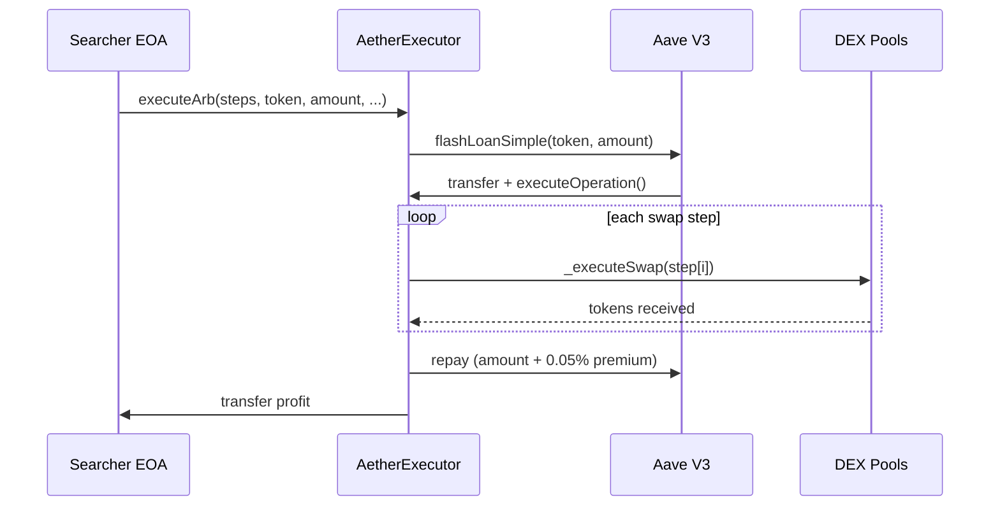

# Smart Contract

The `AetherExecutor.sol` contract is the on-chain component that receives flash loans and executes multi-hop swaps. It's the final step in the arbitrage pipeline.

## Overview

- **Inherits:** `IFlashLoanSimpleReceiver` (Aave V3), `Ownable`, `ReentrancyGuard` (OpenZeppelin)
- **Deployed on:** Ethereum Mainnet
- **Build tool:** Foundry (`forge`)

## Contract Flow



## Entry Point: `executeArb()`

```solidity
function executeArb(
    SwapStep[] calldata steps,
    address flashloanToken,
    uint256 flashloanAmount,
    uint256 deadline,
    uint256 minProfitOut,
    uint256 tipBps
) external onlyOwner nonReentrant
```

| Parameter | Description |
|---|---|
| `steps` | Ordered array of swap hops to execute |
| `flashloanToken` | Token to borrow from Aave V3 |
| `flashloanAmount` | Amount to borrow |
| `deadline` | Block timestamp after which the transaction reverts (`DeadlineExpired`) |
| `minProfitOut` | Minimum profit floor — reverts if net profit is below this |
| `tipBps` | Basis points (0–10,000) of profit sent to `block.coinbase` as builder tip |

This is the main entry point, called by the searcher's EOA. It:

1. Validates `deadline` (reverts if `block.timestamp > deadline`) and `tipBps` (reverts if >10,000)
2. Encodes the swap steps, gas snapshot, `tipBps`, and `minProfitOut` into the flash loan params
3. Calls `POOL.flashLoanSimple()` on the Aave V3 lending pool
4. Aave sends `flashloanAmount` of `flashloanToken` to this contract
5. Aave then calls back into `executeOperation()`

## Aave Callback: `executeOperation()`

```solidity
function executeOperation(
    address asset,
    uint256 amount,
    uint256 premium,
    address initiator,
    bytes calldata params
) external returns (bool)
```

Called by Aave after transferring the flash loan. This function:

1. Decodes the swap steps from `params`
2. Loops through each step, calling `_executeSwap()` for each
3. After all swaps, calls `_repayAndDistribute()` to repay Aave and distribute profit

::: warning
The `initiator` must be `address(this)` — the contract validates it received the callback from a legitimate flash loan it initiated.
:::

## Swap Router: `_executeSwap()`

Routes each swap step to the correct DEX based on the protocol enum:

```solidity
function _executeSwap(SwapStep memory step, uint256 index) internal {
    if (step.protocol == UNISWAP_V2) { ... }
    else if (step.protocol == UNISWAP_V3) { ... }
    else if (step.protocol == SUSHISWAP) { ... }
    else if (step.protocol == CURVE) { ... }
    else if (step.protocol == BALANCER_V2) { ... }
    else if (step.protocol == BANCOR_V3) { ... }
}
```

The `index` parameter identifies the hop position and is used in revert messages for debugging failed swaps.

### Protocol Constants

```solidity
uint8 constant UNISWAP_V2 = 1;
uint8 constant UNISWAP_V3 = 2;
uint8 constant SUSHISWAP = 3;
uint8 constant CURVE = 4;
uint8 constant BALANCER_V2 = 5;
uint8 constant BANCOR_V3 = 6;
```

### Slippage Protection

Every swap step includes a `minAmountOut` field. If the actual output is less than this threshold, the swap reverts. Default slippage tolerance is 1%.

### Token Transfers

All token transfers use OpenZeppelin's `SafeERC20` to handle non-standard ERC20 implementations (tokens that don't return `bool` on transfer).

## Profit Distribution: `_repayAndDistribute()`

After all swaps complete:

1. Approve Aave to pull back `amount + premium` (flash loan repayment + 0.05% fee)
2. Calculate profit: `balance - amount - premium`
3. Transfer profit to the contract `owner`

If the final balance is less than `amount + premium`, the entire transaction reverts — this is the atomic safety guarantee.

## Emergency Functions

### `rescue()`

```solidity
function rescue(address token, uint256 amount) external onlyOwner
```

Emergency withdrawal of tokens stuck in the contract. Only callable by the owner (cold wallet). Used in incident response scenarios — see [Incident Response](/operations/incident-response).

### `setApprovals()`

```solidity
function setApprovals(address[] calldata tokens, address[] calldata spenders) external onlyOwner
```

Batch-sets max ERC20 approvals for DEX routers and the Aave pool. Both arrays must be the same length. Pre-approving common tokens eliminates per-swap approval overhead. Uses `forceApprove` with `type(uint256).max`.

## Security Model

- **`onlyOwner`** on all state-changing functions — owner is the cold wallet, not the searcher hot wallet
- **`nonReentrant`** (ReentrancyGuard) on `executeArb()` — prevents reentrancy attacks
- **Deadline validation** — bundles target a specific block, stale executions are rejected
- **Custom errors** — Gas-efficient error handling (cheaper than string revert reasons)
- **No `selfdestruct`** — Contract is immutable once deployed
- **Flash loan validation** — `executeOperation` verifies the callback came from a legitimate self-initiated flash loan

## Testing

Tests are in `contracts/test/AetherExecutor.t.sol` using Foundry's testing framework:

```bash
cd contracts && forge test
```

Tests cover:
- Successful multi-hop arbitrage execution
- Revert on unprofitable trades
- Access control (`onlyOwner`)
- Reentrancy protection
- Slippage protection
- Emergency rescue function
- Each protocol's swap routing
