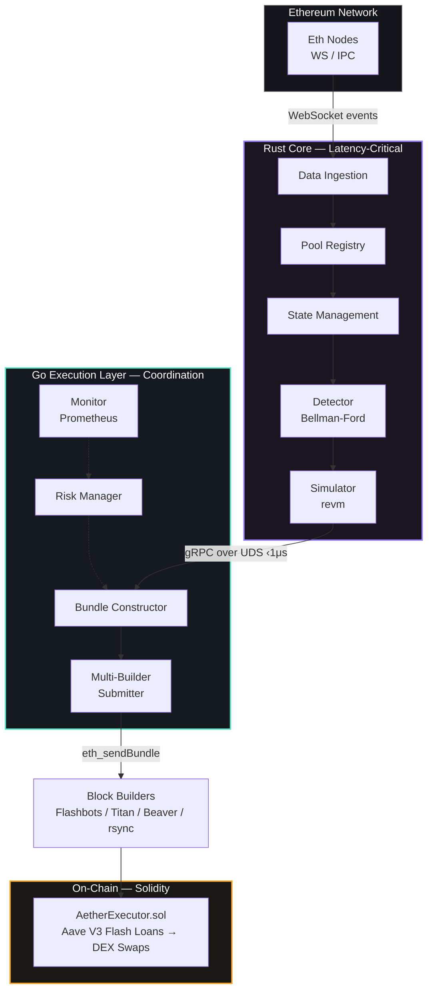
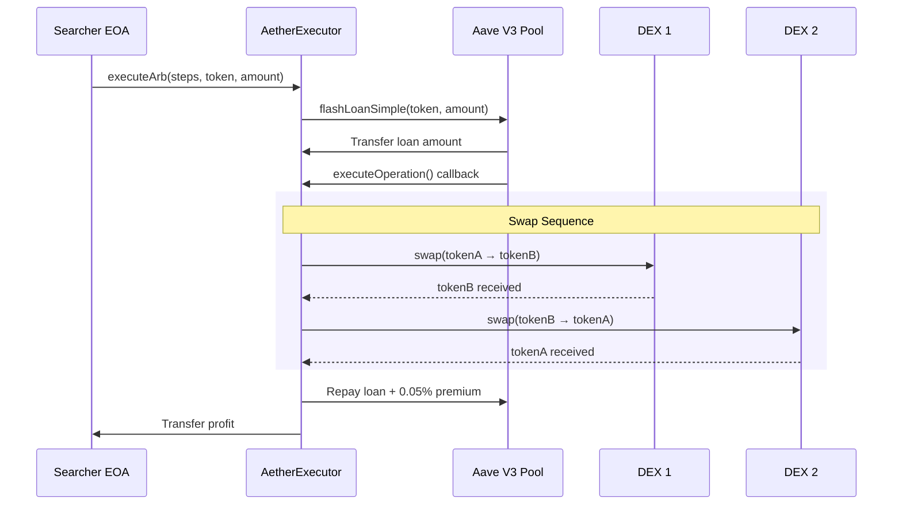

# How It Works

Aether's pipeline processes an Ethereum event from detection to bundle submission in under 15 milliseconds. This page walks through each step.

## Architecture Overview

## The Hot Path

<Timeline>
  <TimelineItem time="0 — 0.2ms" title="Event Ingestion">

Aether maintains WebSocket connections to multiple Ethereum nodes. It subscribes to `newHeads`, `logs`, and `pendingTransactions`. Events are ABI-decoded at compile time via `alloy::sol!` — topic matching takes ~4 CPU cycles, full decode under 200ns per event.

  </TimelineItem>
  <TimelineItem time="0.2 — 0.5ms" title="State Update">

Pool state is updated in the in-memory store (`DashMap`). The price graph is then refreshed — only edges affected by the update are recomputed using dirty bit tracking.

  </TimelineItem>
  <TimelineItem time="0.5 — 3ms" title="Arbitrage Detection">

Bellman-Ford (SPFA variant) scans the dirty subgraph for negative weight cycles. When found, ternary search optimizes the input amount for maximum profit across ~100 iterations.

  </TimelineItem>
  <TimelineItem time="3 — 8ms" title="EVM Simulation">

Each opportunity is simulated in a forked EVM via `revm`. The exact `AetherExecutor.executeArb()` calldata is executed against the latest block state to verify profitability.

  </TimelineItem>
  <TimelineItem time="8 — 8.5ms" title="gRPC Handoff">

The validated arb is sent from Rust to Go over a Unix Domain Socket. Transport adds sub-microsecond latency — effectively a memory copy.

  </TimelineItem>
  <TimelineItem time="8.5 — 10ms" title="Bundle Construction">

Go constructs a Flashbots bundle: an arb transaction calling `executeArb()` and a tip transaction sending 90% of profit to the builder's coinbase. Both are EIP-1559 and signed with the searcher key.

  </TimelineItem>
  <TimelineItem time="10 — 12ms" title="Multi-Builder Submission" color="green">

The signed bundle is submitted simultaneously to all configured builders via goroutine fan-out — Flashbots, Titan, Beaver, and rsync.

  </TimelineItem>
</Timeline>

## Price Graph Transform

The detection engine uses a mathematical trick to convert arbitrage detection into a well-known graph problem.

<Accordion>
  <AccordionItem title="Why negative log edge weights?">

Exchange rates are multiplicative — a profitable cycle means:

`rate_1 × rate_2 × ... × rate_n > 1.0`

By storing `-ln(rate)` as edge weights, this becomes additive:

`-ln(rate_1) + -ln(rate_2) + ... + -ln(rate_n) < 0`

A **negative sum** around a cycle means a profitable arbitrage. This is exactly what Bellman-Ford detects — negative weight cycles.

  </AccordionItem>
  <AccordionItem title="Why SPFA over standard Bellman-Ford?">

Standard Bellman-Ford relaxes all edges V-1 times. SPFA uses a queue that only processes nodes whose distances were actually updated. For the sparse, partially-updated graphs typical in DEX arbitrage, this is 2-3x faster in practice.

The SLF (Shortest-Label-First) optimization further reduces work by inserting shorter-distance nodes at the front of the deque.

  </AccordionItem>
  <AccordionItem title="How does input optimization work?">

Once a profitable cycle is found, we need the optimal trade size. The profit function is concave for AMM-based DEXes (larger inputs hit diminishing returns from price impact).

Ternary search converges on the maximum in ~60 iterations for U256 precision. This gives us the exact flash loan amount that maximizes net profit after gas and premiums.

  </AccordionItem>
</Accordion>

## On-Chain Execution Flow

If at any point the trade is unprofitable, the transaction reverts — the flash loan is never taken, and no gas is spent (bundled transaction).

## Simulation Safety

::: warning Critical Invariant
The simulation **must** use the same block state as the execution target. Stale simulations produce reverted bundles.
:::

The simulator forks the latest block state into a `CacheDB`, executes the exact calldata that will be submitted on-chain, and verifies the output. Only opportunities that pass simulation are forwarded to the Go executor.

## Next Steps

- [Getting Started](/guide/getting-started) — Build and run Aether
- [Architecture Overview](/architecture/overview) — Detailed component breakdown
- [Rust Core](/architecture/rust-core) — Deep dive into the detection engine
