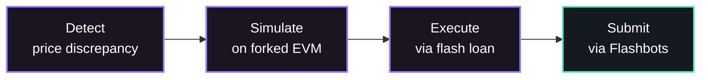

# Introduction

Aether is a production-grade, cross-DEX arbitrage engine for Ethereum Mainnet. It detects and executes price discrepancies across decentralized exchanges in under 15 milliseconds, using flash loans to eliminate capital risk entirely.

## What Problem Does Aether Solve?

Decentralized exchanges on Ethereum often have different prices for the same token pair. When USDC/WETH trades at a different rate on Uniswap V2 vs. SushiSwap, there's a profit opportunity — buy where it's cheap, sell where it's expensive, pocket the difference.

This is **MEV (Maximal Extractable Value) arbitrage**. Aether automates the entire pipeline:

## Supported Protocols

| Protocol | Type | Complexity |
|---|---|---|
| Uniswap V2 | Constant Product AMM | O(1) |
| Uniswap V3 | Concentrated Liquidity | O(n_ticks) |
| SushiSwap | Constant Product AMM | O(1) |
| Curve | StableSwap (Newton's method) | O(iterations) |
| Balancer V2 | Weighted Constant Product | O(1) |
| Bancor V3 | Bonding Curve with BNT | O(1) |

## Tech Stack

| Layer | Language | Key Libraries |
|---|---|---|
| Data Ingestion & ABI Parsing | **Rust** | `tokio`, `alloy`, WebSocket |
| Pool State Management | **Rust** | `DashMap`, arena allocators |
| Arbitrage Detection | **Rust** | Bellman-Ford (SPFA), SIMD math |
| EVM Simulation | **Rust** | `revm` (fork mode) |
| Bundle Construction & Submission | **Go** | `go-ethereum`, `flashbotsrpc` |
| Risk Management & Circuit Breakers | **Go** | Stateful controllers, `sync/atomic` |
| Monitoring & API | **Go** | Prometheus, gRPC, `net/http` |
| On-Chain Executor | **Solidity** | Aave V3 Flash Loans, OpenZeppelin |

## Core Design Principles

<Accordion>
  <AccordionItem title="Zero-Copy Hot Path">

Lock-free data structures, arena allocators, and zero-copy deserialization. No heap allocation on the hot path. Every nanosecond matters when competing for MEV.

  </AccordionItem>
  <AccordionItem title="Separation of Concerns">

Rust handles all latency-critical work (event processing, detection, simulation). Go handles coordination (bundle building, submission, risk management, monitoring). Each language is used where it excels.

  </AccordionItem>
  <AccordionItem title="Fail-Safe by Default">

Circuit breakers at every component. Gas too high? Auto-halt. Too many reverts? Auto-pause. Balance low? Auto-halt. The system protects itself without human intervention.

  </AccordionItem>
  <AccordionItem title="Atomic Execution">

All arbitrage trades are flash loan-backed through Aave V3. If the trade isn't profitable after gas costs, the entire transaction reverts. Zero capital is ever at risk.

  </AccordionItem>
  <AccordionItem title="MEV-Aware Submission">

Bundles are submitted through Flashbots Protect, MEV-Share, and direct builder APIs. Transactions never enter the public mempool, preventing frontrunning.

  </AccordionItem>
  <AccordionItem title="Extensible Pool Registry">

Adding a new DEX protocol requires implementing a single Rust trait. Pool configuration is hot-reloadable via TOML — no restarts needed.

  </AccordionItem>
</Accordion>

## Performance Targets

| Metric | Target |
|---|---|
| Event decode + state update | <1ms |
| Bellman-Ford detection | <3ms |
| EVM simulation (revm) | <5ms |
| gRPC Rust → Go | <1ms |
| Bundle build + sign | <2ms |
| **Total end-to-end** | **<15ms** |
| Events processed per block | 10,000+ |
| Pools monitored | 5,000+ |
| Simulations per second | 200+ |

## Next Steps

- [How It Works](/guide/how-it-works) — Understand the 7-step hot path from event to submission
- [Getting Started](/guide/getting-started) — Build and run Aether locally
- [Architecture Overview](/architecture/overview) — Deep dive into the system design
