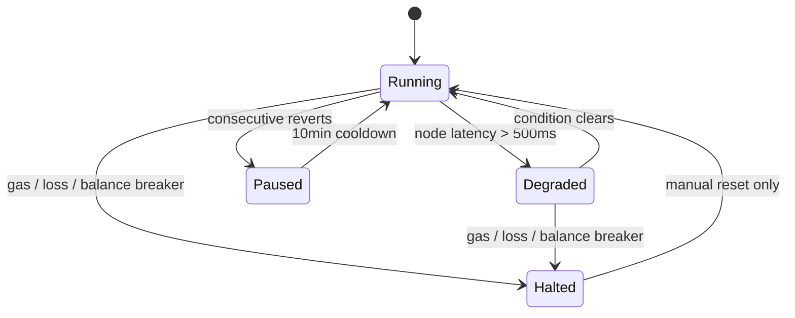

# Risk Parameters

Detailed documentation of Aether's risk management system — circuit breakers, position limits, and system state machine.

## System State Machine



| State | Description | Entry Conditions | Recovery |
|---|---|---|---|
| **Running** | Normal operation | Startup, manual reset | — |
| **Degraded** | Reduced functionality | Node latency >500ms | Automatic when condition clears |
| **Paused** | Detection stopped | Consecutive reverts | Automatic after 10-minute cooldown |
| **Halted** | All operations stopped | Gas >300 gwei, daily loss, low balance | **Manual reset required** |

### Manual State Reset

```bash
# Resume from any non-Running state
grpcurl -plaintext localhost:50051 aether.ControlService/SetState \
    -d '{"state": "RUNNING"}'
```

::: danger
Only resume from HALTED after investigating and fixing the root cause. Resuming blindly can result in further losses.
:::

## Circuit Breakers

### Gas Price Breaker

| Parameter | Value | Config Key |
|---|---|---|
| Threshold | 300 gwei | `circuit_breakers.max_gas_gwei` |
| Action | **HALT** | — |
| Recovery | Manual reset after gas drops | — |

**Rationale:** At 300+ gwei, gas costs consume most or all of the arbitrage profit. Executing trades at these gas prices is almost certainly unprofitable.

### Consecutive Reverts Breaker

| Parameter | Value | Config Key |
|---|---|---|
| Threshold | 10 reverts | `circuit_breakers.consecutive_reverts_pause` |
| Window | 10 minutes | `circuit_breakers.revert_window_minutes` |
| Action | **PAUSE** | — |
| Recovery | Automatic after 10-minute cooldown | — |

**Rationale:** Multiple consecutive reverts suggest a systematic issue (stale state, aggressive competition, or a bug). Pausing prevents further wasted gas while the issue resolves or is investigated.

::: tip
Only **bug reverts** count toward this threshold. Competitive/MEV reverts (where another searcher captured the same opportunity first) are excluded and tracked separately via `competitive_revert_alert_pct`.
:::

### Daily Loss Breaker

| Parameter | Value | Config Key |
|---|---|---|
| Threshold | 0.5 ETH loss | `circuit_breakers.daily_loss_halt_eth` |
| Action | **HALT** | — |
| Recovery | Manual reset after investigation | — |

**Rationale:** A daily loss exceeding 0.5 ETH indicates something is fundamentally wrong — either the strategy is losing money, or there's a bug causing failed trades with gas costs.

### Balance Breaker

| Parameter | Value | Config Key |
|---|---|---|
| Threshold | 0.1 ETH | `circuit_breakers.min_eth_balance` |
| Action | **HALT** | — |
| Recovery | Manual reset after topping up wallet | — |

**Rationale:** The searcher wallet needs ETH for gas. If balance drops below 0.1 ETH, there's not enough gas budget for safe operation.

### Node Latency Breaker

| Parameter | Value | Config Key |
|---|---|---|
| Threshold | 500ms | `circuit_breakers.max_node_latency_ms` |
| Action | **DEGRADE** | — |
| Recovery | Automatic when latency drops | — |

**Rationale:** High node latency means stale state data, leading to inaccurate detection and reverted trades.

### Bundle Miss Rate Alert

| Parameter | Value | Config Key |
|---|---|---|
| Threshold | 80% miss rate | `circuit_breakers.bundle_miss_rate_alert_pct` |
| Window | 60 minutes | `circuit_breakers.bundle_miss_rate_window_minutes` |
| Action | **ALERT** | — |

**Rationale:** If >80% of bundles aren't being included, something is wrong with builder connectivity, tip calculation, or bundle construction.

### Competitive Revert Alert

| Parameter | Value | Config Key |
|---|---|---|
| Threshold | 90% | `circuit_breakers.competitive_revert_alert_pct` |
| Action | **ALERT** | — |

**Rationale:** If 90%+ of reverts are competitive (another searcher captured the opportunity), Aether is consistently too slow. Indicates need for latency optimization.

## Position Limits

### Max Single Trade

| Parameter | Value | Config Key |
|---|---|---|
| Limit | 50 ETH | `position_limits.max_single_trade_eth` |

Maximum flash loan amount per trade. Caps exposure to any single arbitrage opportunity.

### Max Daily Volume

| Parameter | Value | Config Key |
|---|---|---|
| Limit | 500 ETH | `position_limits.max_daily_volume_eth` |

Cumulative trading volume cap per 24-hour period. Prevents runaway trading in edge cases.

### Min Profit

| Parameter | Value | Config Key |
|---|---|---|
| Limit | 0.001 ETH | `position_limits.min_profit_eth` |

Minimum net profit (after gas + flash loan premium) required to execute a trade. Filters out dust-level opportunities that aren't worth the execution risk.

### Tip Share Range

| Parameter | Value | Config Key |
|---|---|---|
| Minimum | 50% | `position_limits.min_tip_share_pct` |
| Maximum | 95% | `position_limits.max_tip_share_pct` |

Percentage of profit sent to the block builder as a tip. Higher tips increase inclusion probability but reduce profit. The range ensures:
- **Min 50%:** Builders have sufficient incentive to include the bundle
- **Max 95%:** Aether retains at least 5% of profit
